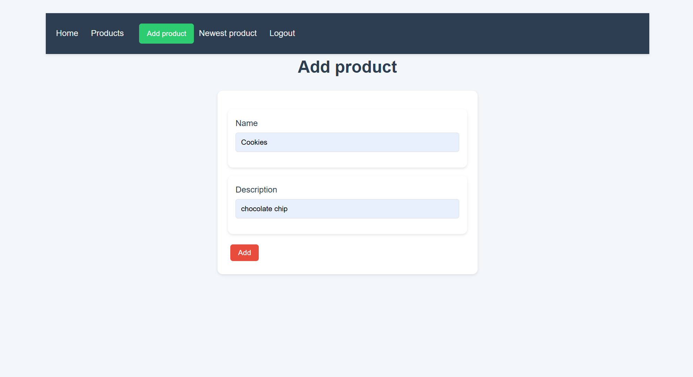

# Pomocnicy

W trakcie pracy nad zadaniami (ćwiczeniami), będziecie spotykać się z różnymi pomocnikami, którzy będą wskazywać, co należy zrobić w danym fragmencie kodu. Im dalsze ćwiczenie, tym rzadziej będą się pojawiać. Oto krótka charakterystyka każdego z nich:

### 🔧 _Configo The Setter_ - **Konfiguracja aplikacji**

Pokazuje miejsca w których powinny zostać zdefiniowane elementy związane z ustawieniem aplikacji, takie jak port, zmienne środowiskowe, itp.

_Przykład:_ **Zdefiniuj stałą PORT. Pamiętaj nadać jej wartość.**

### 🧩 _Puzzlo the Missing Piece_ - **Brakujący element kodu**

Pokazuje miejsca, gdzie należy dopisać fragment kodu, ponieważ go brakuje.

_Przykład:_ **Brakuje tutaj funkcji, wyliczającej sumę produktów w koszyku.**

### 🏗 _Structo the Builder_ - **Nowy kod, który trzeba dodać**

Pokazuje miejsca, gdzie napisać nowy kod a czasami nawet, podpowiada fragment tego kodu.

_Przykład:_ **Stwórz funkcję 'homeRouting', która obsłuży stronę główną.**

### 🔥 _Crashy the Firestarter_ - **Błąd w kodzie, wymagający poprawy**

Pokazuje miejsca występowania błędu w kodzie, tzw. _bug_.

_Przykład:_ **Tutaj pojawia się błąd! Należy go naprawić, inaczej routing nie będzie działał!**

### 🔄 _Refactoro the Changer_ - **Brakujący element kodu**

Pokazuje miejsca, gdzie aktualna implementacja jest nieczytelna, mało wydajna lub po prostu przestarzała i nie wystarczająca na aktualne potrzeby.

_Przykład:_ **Funkcja 'createNewProduct' otrzymuje dodatkowo z formularza kwotę produktu. Nie ma potrzeby tworzyć cenę za pomocą 'randomizeProductPrice'.**

### 📦 _Dependy the Importer_ - **Import modułów, nowa zależność lub pakiet**

Pokazuje miejsca, gdzie należy dopisać import modułu, zależności, pakietu lub potrzebę wykorzystania nowej zależności i jej zainstalowania.

_Przykład:_ **Zaimportuj funkcję 'requestRouting' z modułu 'routing/routing.js'.**

### 🔍 _Buggsy the Debugger_ - **Potencjalny problem**

Pokazuje miejsca, gdzie należy dopisać fragment kodu, ponieważ go brakuje.

_Przykład:_ **Brakuje tutaj funkcji, wyliczającej sumę produktów w koszyku.**
